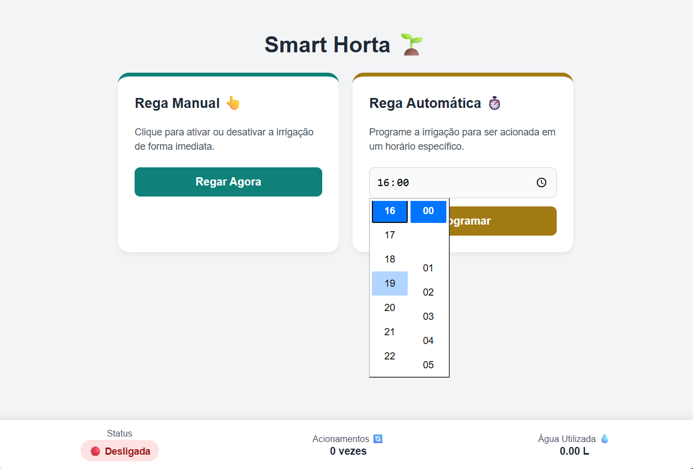

# SMART HORTA 🌱
Controle de irrigação de hortaliças para apartamentos ou pequenos espaços.

O Smart Horta é um projeto de automação desenvolvido em C++ para o microcontrolador ESP8266. Sua arquitetura modular gerencia o acionamento de uma bomba d'água através de um relé, oferecendo uma interface web embutida para controle manual e programação de regas diárias automáticas baseadas em horário real (NTP). O sistema também calcula e exibe estatísticas de uso, como número de acionamentos e estimativa de volume de água (litros) consumido.
 

  

# Instalação
- Acesse o arquivo [config.h](src/smart_horta/config.h) e altere as credenciais do WiFi para as da sua rede.
- Configure a Arduino IDE para sua placa NodeMCU.
- Abra o arquivo [smart_horta.ino](src/smart_horta/smart_horta.ino) e compile o projeto enviando-o para seu NodeMCU.
- Aguarde a conexão do NodeMCU com a rede WiFi _(você pode acompanhar os logs pelo monitor serial da própria Arduino IDE)_
- Aguarde a inicialização do servidor NTP e a confirmação de aquisição de horário.
- Acesse o IP gerado pelo sistema _(será o endereço da página web por onde controlará o sistema)_

## Módulos
O projeto está modularizado, com cada módulo com sua responsabilidade específica.

### Plants
Este módulo define regras de negócio e parâmetros definidos para a irrigação.

### Timer
Este módulo é responsável por garantir a automação da irrigação, proporcionando opções de programação para o usuário.

> **Nota:** até o momento deste commit, há apenas a opção de irrigar uma vez ao dia. Nessa opção, todos os dias, o sistema é acionado no horário definido.

### WaterPump
Este módulo cuida exclusivamente da manipulação do hardware da bomba d'água.

### WebServer
Este módulo define a criação de um servidor web para controlar remotamente o sistema.

## Hardware utilizado
- Placa de desenvolvimento NodeMCU - ESP8266
- Módulo relé de 1 canal
- Bomba d'agua 5v